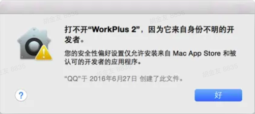
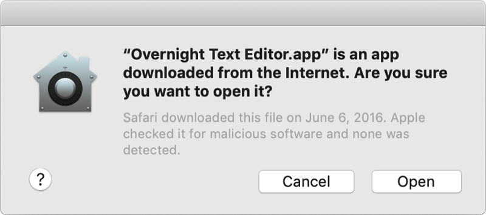
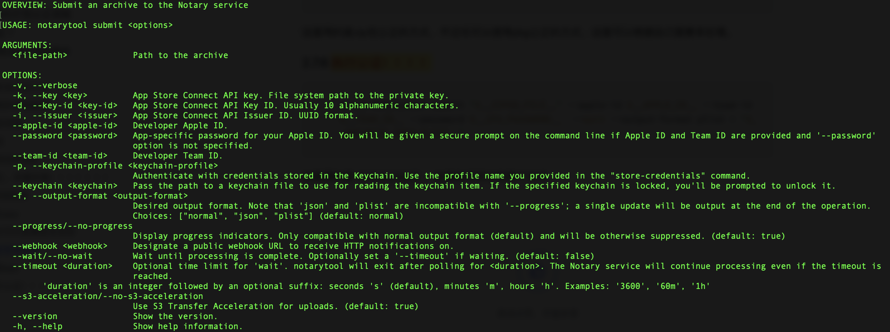

使用方法，先cd到Xcode工程目录，然后下载脚本文件并配置好package_options参数，最后执行脚本：

```shell
sh path/to/package.sh -c Release
```


# 1. 为什么要公正 ？

从macOS 10.14.5开始，使用新的开发者ID证书和所有新的或更新的内核扩展签名的软件必须经过公证才能运行。从macOS 10.15开始，2019年6月1日以后构建的所有软件，以及使用开发者ID分发的软件都必须经过公证。但是，你不需要对你通过Mac应用商店发布的软件进行公证，因为应用商店的提交过程已经包含了同等的安全检查。

如果不经过公证就发布，用户在使用的时候会有以下提示（网上找的图），这样的提示，对用户来说，就非常的不友好了，谁还敢正常使用呢 ？



但是对于正常公正过的app，则会是如下正常的提示，很明显到，这种提示更让人放心。



# 2. 一起写一个自动化打包的脚本

## 2.1 前提

- 公正的流程使用最新的`notarytool` ，因为旧版本的 `altool --notarization-info` 将在后续版本废弃掉。

- 当前编写的过程是用于Jenkins中公正的，又因为Jenkins中有多个任务，所以为了保证脚本不被频繁的copy，所以脚本和任务的目录结构会比较不一样

- 我们项目是有多个target，每次的打包都需要为每个target都打出一个release包或者RC包，所以部分编译相关的参数都是写成了配置文件的形式放在一起

- 变量的命名，因为在Jenkins中有不少的内置属性，为了少的出现命名的冲突，所以在脚本内部使用的临时变量都以`__xxxx__` 的形式命名。

- 整个文章都是顺序写的，其中有很多步骤是可以在之前做的，但不想拆开来，就放到了每步中了。

## 2.2 获取脚本执行的入参

因为想要做到的一些参数的定制化，所以使用了shell的`getopts`来获取入参。

```Bash
# 是否需要带有颜色的输出
# 在terminal为了查看方便，带颜色比较好，但是在jenkins里又显示不了颜色
 __ATTRIBUTED_LOG__=false

while getopts ":c:a" opt
do
    case $opt in
        a)
            # 打包类型，Release RC Debug
             __ATTRIBUTED_LOG__=true
            ;;
        c)
            # 打包的分支
            __WORKING_CONFIGURATION__=$OPTARG
            ;;
        h)
            echo " 执行打包公正流程"
            echo ""
            echo " 参数列表"
            echo "  -c configuration Release、Beta，不可为空"
            echo "  -a attributed log，可为空，是否带有颜色的输出日志"
            exit 1;;
        ?)
            echo "unknown"
            exit 1;;
    esac
done
```

## 2.3 获取全局的参数配置

获取打包相关的配置文件：

```Bash
# 打包相关的配置文件
__PACK_OPTIONS_FILE__="${__SOURCE_PATH__}/package_options.plist"
```

配置格式如图，此处采用的是`plist`的方式，因为在Mac系统我们可以使用`PlistBuddy`来获取对应的结果：


然后从中获取各种需要的参数：

- 工程名，打包的时候需要
  - ```Bash
    __PROJ_NAME__=$(/usr/libexec/PlistBuddy -c "print :projname" $__PACK_OPTIONS_FILE__)
    ```

- 电脑解锁密码，用于解锁钥匙串
  - ```Bash
    __MAC_PWD__=$(/usr/libexec/PlistBuddy -c "print :macpwd" $__PACK_OPTIONS_FILE__)
    ```

- apple id，用于公正流程
  - ```Bash
    __APPLE_ID__=$(/usr/libexec/PlistBuddy -c "print :appleID" $__PACK_OPTIONS_FILE__)
    ```

- app专用密码，因为就像三方登录等业务类似，总会有些业务场景需要你的账户密码，但是这又是一个比较隐私的东西，所以就需要这个临时的专用密码，具体的用处可以看看苹果的[特别说明](https://support.apple.com/zh-cn/HT204397)，里面有生成的步骤和说明。
  - ```Bash
    __2FA_PASSWORD__=$(/usr/libexec/PlistBuddy -c "print :password" $__PACK_OPTIONS_FILE__)
    ```

- 当前打包的版本号，因为直接从 `info.plist` 中获取，会是一个静态常量，所以可以从任意一个target的工程文件中读取
  - ```Bash
    __BUILD_PROJ_VER__=$(sed -n '/MARKETING_VERSION/{s/MARKETING_VERSION = //;s/;//;s/^[[:space:]]*//;p;q;}' `ls ./ | grep .*xcodeproj`/project.pbxproj)
    ```

- 里面还有其他的一些参数，后面用到的时候会特别说明。

## 2.4 打包参数获取

在脚本内写了一个方法，用于执行打包的流程，因为各个target打包流程都一样，所以用一个通用方法可以省很多事。

该方法有一个个入参，就是`Target`，我们以`__BUILDING_TARGET__`变量承接，上面也说了，我们会有多个target，这个入参就是为了知道是打哪个包。

下面就是根据打包类型获取的相关打包参数：

- 当前打包项目对应target的bundle id
  - ```Bash
    __BUNDLE_ID__=$(/usr/libexec/PlistBuddy -c "print :target:$1:bundleid" $__PACK_OPTIONS_FILE__)
    ```

- 获取dmg显示名字，用于显示在dmg打开时finder上的名字
  - ```Bash
    __DMG_CONFIG_NAME__=$(/usr/libexec/PlistBuddy -c "print :target:$1:dmgName" $__PACK_OPTIONS_FILE__)
    ```

- 获取dmg文件名称
  - ```Bash
    __DMG_CONFIG_FILE_NAME__=$(/usr/libexec/PlistBuddy -c "print :target:$1:dmgFileName" $__PACK_OPTIONS_FILE__)
    ```

- 签名证书，如 `Developer ID Application: xxxx Pte Ltd (322Yxxxxxxx)`
  -  在钥匙串中查找，也可以用 `security find-identity -v` 命令来获取设备上所有可用的证书(`identity`)。

  - ```Bash
    __BUILDING_CERT__=$(/usr/libexec/PlistBuddy -c "print :target:$1:config:$__WORKING_CONFIGURATION__:cert" $__PACK_OPTIONS_FILE__)
    ```

- 团队的id，签名证书后面括号里的内
  - ```Bash
    __TEAM_ID__=$(/usr/libexec/PlistBuddy -c "print :target:$1:config:$__WORKING_CONFIGURATION__:teamid" $__PACK_OPTIONS_FILE__)
    ```

- 用于打包的scheme
  - ```Bash
    __BUILDING_SCHEME__=$(/usr/libexec/PlistBuddy -c "print :target:$1:config:$__WORKING_CONFIGURATION__:scheme" $__PACK_OPTIONS_FILE__)
    ```

- entitlements，Xcode的一些授权信息
  - ```Bash
    __ENTITLEMENTS__=$(/usr/libexec/PlistBuddy -c "print :target:$1:entitlements" $__PACK_OPTIONS_FILE__)
    ```

## 2.5 编译项目

对于自动化编译流程来说，首先必须把 `get-task-allow` 设置为`false`，但是需要注意的是，在正常的开发过程中，这个值必须保持为`true`，具体的可以看苹果的[官方说明](https://developer.apple.com/documentation/security/notarizing_macos_software_before_distribution/resolving_common_notarization_issues#3087731)。

```Bash
/usr/libexec/PlistBuddy -c "set com.apple.security.get-task-allow 0" "./$__ENTITLEMENTS__"
```

然后清理一下编译残留信息，防止之前的编译对本次有影响：

```Bash
xcodebuild clean -workspace $__PROJ_NAME__ -scheme $__BUILDING_SCHEME__ -configuration $__XCCONFIGURATION__
```

最后执行项目编译：

```Bash
xcodebuild archive -quiet -workspace $__PROJ_NAME__ -scheme $__BUILDING_SCHEME__ -configuration $__XCCONFIGURATION__ -archivePath $__BUILD_PATH__/$__BUILDING_SCHEME__ -destination generic/platform=macOS
```

编译完成后，记得确保一下是有编译后的归档文件`****.xcarchive`，如果没有的话，就是编译失败，那么就可以退出任务了。

## 2.6 导出编译后的app

首先把导出的配置信息写到本地：

```Bash
cat > "$__EXPORT_OPTIONS_PLIST__" <<- EOF
<?xml version="1.0" encoding="UTF-8"?>
<!DOCTYPE plist PUBLIC "-//Apple//DTD PLIST 1.0//EN" "http://www.apple.com/DTDs/PropertyList-1.0.dtd">
<plist version="1.0">
<dict>
    <key>destination</key>
    <string>export</string>
    <key>method</key>
    <string>developer-id</string>
    <key>signingCertificate</key>
    <string>Developer ID Application</string>
    <key>signingStyle</key>
    <string>manual</string>
    <key>teamID</key>
    <string>${__TEAM_ID__}</string>
</dict>
</plist>
EOF
```

然后执行导出：

```Bash
xcodebuild -exportArchive -archivePath $__ARCHIVE_FILE_PATH__ -exportPath "$__BUILD_PATH__/$__BUILDING_SCHEME__" -exportOptionsPlist "$__EXPORT_OPTIONS_PLIST__"
```

这时导出的就是我们需要的 `***.app`文件。

```Bash
__ARCHIVED_APP_NAME__=`ls "$__BUILD_PATH__/$__BUILDING_SCHEME__" | grep .*app$`
```

在这里我们也需要判断一下是否有对应的app文件，否则就算导出失败，那么就可以直接退出任务了。

如果app文件有效的话，记得把dSYM文件也导出，因为后续的线上崩溃日志分析需要用到它。

```Bash
# 拷贝dsym文件
__DSYM_FILE_NAME__=`ls "$__ARCHIVE_FILE_PATH__/dSYMs" | grep .*app\.dSYM`
__DSYM_FILE_PATH__="$__ARCHIVE_FILE_PATH__/dSYMs/$__DSYM_FILE_NAME__"

if [ -d "$__DSYM_FILE_PATH__" ]; then
    cp -R "$__DSYM_FILE_PATH__" "$__ARCHIVE_DSYM_FOLDER__/${__DSYM_FILE_NAME__}_${__BUILD_PROJ_VER__}.dSYM"
else
    exit 1
fi
```

## 2.7 签名app

### 2.7.1 解锁钥匙串

```Bash
security unlock-keychain -p "$__MAC_PWD__" ~/Library/Keychains/login.keychain
```

### 2.7.2 签名app

```Bash
codesign --verify --timestamp --options runtime -f -s "$__BUILDING_CERT__" --deep --entitlements "$__ENTITLEMENTS__" "$__ARCHIVED_APP_PATH__"
```

在签名的时候可能会遇到这样的错误 `The executable does not have the hardened runtime enabled.` 需要加上 `--options=runtime`。

### 2.7.3 此时可以查看签名信息

```Bash
codesign -dv --verbose=4 "$__ARCHIVED_APP_PATH__"
```

这个对于调试过程中有用，但是在整个脚本执行的过程中没啥必要。

### 2.7.4 验证签名结果

```Bash
spctl --verbose=4 --assess --type execute "$__ARCHIVED_APP_PATH__"
```

查看是否签名成功可以得到下面的结果，不过在当前位置肯定是不成功的，因为当前还没执行公证呢，在执行完后面的步骤后就会不一样了。

```Bash
./build/xxxxx-Release/xxxx.app: accepted
source=Unnotarized Developer ID
override=security disabled
```

## 2.8 公证

### 2.8.1 压缩app

```Bash
ditto -c -k --keepParent "$__ARCHIVED_APP_PATH__" "$__ZIPED_FILE__" && rm -rf "$__ARCHIVED_APP_PATH__"
```

这里用的是zip包公正的方式，不过也可以使用pkg公正的方式，这里可以根据自己需要来处理。

### 2.8.2 执行公证！！！！

```Bash
xcrun notarytool submit "$__ZIPED_FILE__" --apple-id $__APPLE_ID__ --team-id $__TEAM_ID__ --password $__2FA_PASSWORD__  --wait --output-format plist > "$__NOTARIZE_INFO_PLIST__"
```

这里用的是`notarytool`，这里执行可以有两个方式，我们先看一下notarytool的帮助信息，在终端查看：`xcrun notarytool submit --help`，会有以下结果：



这里有两种公证方式：

1. `xcrun`` notarytool submit xxxx.zip --apple-id xxxx --team-id xxxx --password xxxx --wait`
   1. 这种方式是直接把账号、密码等带在了执行的命令中，对于开放的脚本来说，这很不友好，很容易暴露个人隐私信息等。

1. `xcrun`` notarytool submit xxxx.zip --keychain-profile xxxxx --wait`
   1. 这种执行方式是提前把用户信息存到了keychain中，后续使用的时候直接用存储的key即可，见`2.8.6`

### 2.8.3 `--wait`

阻塞脚本的执行直到公正结束，可以看到`Waiting for processing to complete`的提示 ，如果不加，该命令会直接结束，并返回一个 `UUID` ，用于查询公正结果，这里跟公证命令一样，可以用带有账户密码的方式，也可以用`--keychain-profile`的方式：

```Bash
xcrun notarytool info "notary result uuid" --keychain-profile "profile key"
```

结果如下，就说明公正成功：

```Bash
Successfully received submission info
createdDate: 2022-09-24T06:22:39.053Z
id: 84f741ed-9e44-43d4-93d4-91b724c2d98e
name: xxxxx RC.zip
status: Accepted
```

### 2.8.4 查看公证历史

```Bash
xcrun notarytool history --keychain-profile "keychain profile name"
```

### 2.8.5 `--output-format plist` 格式化公正结果

在公证的时候或者查询公证结果的时候，可以加上这个参数，用来格式化公证结果为需要的格式。如果不加的话，会是 2.8.3 中的结果一样，是以字符串的方式输出，但是因为有PlistBuddy，所以，还是 plist 格式方便查看。

### 2.8.6 把账户信息存到keychain中

在上面的内容中提到，可以直接使用 `--keychain-profile` 的方式代替直接在命令中带入账户密码等信息，命令如下：

```Bash
xcrun notarytool store-credentials "NotarizationItemName"  --apple-id  "$Your_AC_USERNAME"  --team-id  "$YourTeamId"  --password "$Your_ACPassword"
```

执行成功后可以在终端上看到如下日志：

```Bash
This process stores your credentials securely in the Keychain. You reference these credentials later using a profile name.
 
Validating your credentials...
Success. Credentials validated.
Credentials saved to Keychain.
To use them, specify `--keychain-profile "NOTARIZATION_xxxxxx"`
```

也可以在keychain中查看到如下的信息：


在这里遇到一个暂时无法解决的问题，因为我们有三个target，但是在存储信息的时候只有一个成功，所以现在项目中使用的是账户密码的方式：

|      | Profile Name         | apple id       | password   | team id  | 结果 |
| ---- | -------------------- | -------------- | ---------- | -------- | ---- |
| TT   | NOTARIZATION_TARGET1 | 同一个Apple ID | 同一个密码 | TEAM_ID1 | 成功 |
| TL   | NOTARIZATION_TARGET2 |                |            | TEAM_ID2 | 失败 |
| TU   | NOTARIZATION_TARGET3 |                |            | TEAM_ID3 | 失败 |

### 2.8.7 公证结果

在上述的流程中，可以看到Status字段，如果显示Accepted，那就说明公证成功了，否则就是失败。

这里有一个很坑的地方，那就是对于沙盒app，如果不做步骤2.5中第一条，那么必定会公证失败，这里是[官方的说明](https://developer.apple.com/documentation/security/notarizing_macos_software_before_distribution/resolving_common_notarization_issues#3087731)。

还有一个比较坑的地方是，如果你用的是旧版的公证方式，那么这里却会公证成功，但是，在app执行的时候却获取不到沙盒目录，只能获取到用户目录下的Documents目录。

## 2.9 绑定ticket到app

在`macOS 10.14`之后, 当用户尝试在电脑上运行一个app时, `GateKeeper`会在线查找`ticket`. 通过`ticket`来判断app是否含有恶意成分.

公证完成之后, 会产生一个`ticket`, 我们需要将`ticket 绑定到我们的app`上, 从而不论电脑是否在联网的状态下Gatekeeper都能发现ticket, Gatekeeper就知道了我的app是公证过了, 是安全的.

在上述公证流程的时候我们提交的是`zip`, 当然我们也可以提交dmg或者pkg, 在绑定ticket时, 要将公证好的包解压出来, 再绑定。

```Bash
# 解压zip包
unzip -q -d "$__BUILD_PATH__/$__BUILDING_SCHEME__" "$__ZIPED_FILE__" && rm "$__ZIPED_FILE__"
# 添加ticket
xcrun stapler staple "$__BUILD_PATH__/$__BUILDING_SCHEME__/$__ARCHIVED_APP_NAME__"
```

添加完后，查看一下是否添加成功：

```Bash
stapler validate -v "$__BUILD_PATH__/$__BUILDING_SCHEME__/$__ARCHIVED_APP_NAME__"
```

如果在输出的结果看到 `The validate action worked!` ，那么就说明添加成功了。

到了这里，当前流程打的包就是一个签名、公证成功后的app了。

# 3. 打包dmg

因为我们分发的是dmg包，所以这里我们就打包成dmg。

这里我用的是一个开源软件 `appdmg`，使用npm安装即可。

这里也有一个很大的坑，那就是配置的json文件中，title不能以中文开头，否则执行会失败，目前官方也没有解决这个问题，一个简单的处理方法就是在title的开头插一个空格即可。

# 4. 帮助文档

| shell getopts    | https://www.mkssoftware.com/docs/man1/getopts.1.asp          |
| ---------------- | ------------------------------------------------------------ |
| 官方文档         | https://developer.apple.com/documentation/security/notarizing_macos_software_before_distribution |
| appdmg           | https://github.com/LinusU/node-appdmg                        |
| app专用密码      | https://support.apple.com/zh-cn/HT204397                     |
| entitlements帮助 | https://developer.apple.com/documentation/security/notarizing_macos_software_before_distribution/resolving_common_notarization_issues#3087731 |
| PlistBuddy       | https://www.marcosantadev.com/manage-plist-files-plistbuddy/ |
| 其他帮助文档     | https://www.bbsmax.com/A/rV57PmRjdP/                         |
|                  | https://blog.csdn.net/shengpeng3344/article/details/103369804 |
|                  | https://blog.macadmin.me/posts/apple-notarytool/             |
|                  | https://juejin.cn/post/7111618906623574052                   |
|                  | https://www.publicspace.net/blog/mac/2019/07/26/some-things-i-wish-i-had-know-before-starting-to-automate-mac-developer-id-notarization/ |