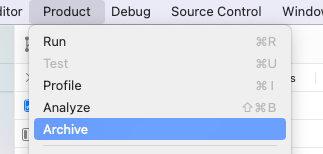

# CI Scripts of macOS APPs

持续集成脚本是为了让我们在工作中更少的把时间放在打包、发布等流程上，让我们可以空出更多时间去做更多有意义的事。

## Files

```
├── README.md
├── appstore.sh
├── background
│   ├── TL.png
│   ├── TT.png
│   └── TU.png
├── documents
│   ├── ReleaseHelp.md
│   └── imgs
│       ├── archive.png
│       ├── notarize.png
│       ├── notary_man.png
│       ├── package_options.png
│       ├── preference.png
│       ├── saved_creds.png
│       ├── unbelieved_app.png
│       └── unnotarized.png
├── package.sh
└── package_options.plist
```


## Requirements

- macOS 11.0+
- Xcode 12.0+
- Apple Developer Account


## Archive



所有的项目想给别人去用，只能打包成可执行程序，发给别人或者发布到分发平台让别人下载，这就需要我们有一个打包的操作。

对于不同的分发方式，又会有不同的操作流程，如下：


### Release

对于Mac app来说，发布到App Store以外是很常见的操作，在macOS 10.15以前，我们只需要以Debug包类似的方法打包然后分发即可；但是自从macOS 10.15推出的安全机制要求我们发布的app必须公证以后，整个流程就变得稍微有点复杂，具体的流程我们可以看这个[Release 打包流程](documents/ReleaseHelp.md)。

使用方法也很简单，先定位到对应的工程目录，然后下载脚本文件并配置好package_options参数，最后执行脚本：

```shell
sh path/to/package.sh -c Release
```

### App Store

打包上传到App Store与其他两种打包方式也类似，不同点在于app导出参数的配置，和两个不同的验证并上传的命令上。

### Debug

对于debug包来说，就相当于我们内部测试的包，不需要公证，不需要签名，只需要编译后把生成的app文件发给别人即可。

使用命令行来做的话，也是只需简单的几步即可：

1. 编译项目

   ```
   # 编译项目
   xcodebuild archive \
   	-workspace xxxx.xcworkspace \
   	-scheme <your scheme> \
   	-configuration <your configuration> \
   	-archivePath <archive path> \
   	-destination generic/platform=macOS > /dev/null 2>&1
   ```

2. 查找并导出app

   ```
   app_name=`ls "<archive file>/Products/Applications" | head -n 1`
   cp -R "<archive file>/Products/Applications/$app_name" "$ARCHIVE_FOLDER/$1"
   ```

就这么简单，对于使用者来说，必须要做的一件事，就是在系统便好设置中勾选“App Store和被认可的开发者 (App Store and identified developers)”选项，如下图：


但是在别人使用的时候，会提示app无效，别担心，有以下两种方法处理：

- 按下`Ctrl`键，这时候再打开app，根据提示即可正常打开；

- 在提示错误后，可以在系统便好设置--安全与隐私--通用下看到如下提示，选择“仍要打开”即可

- 更多的安全打开app相关的官方说明可以[看这里](https://support.apple.com/zh-cn/HT202491)。

  